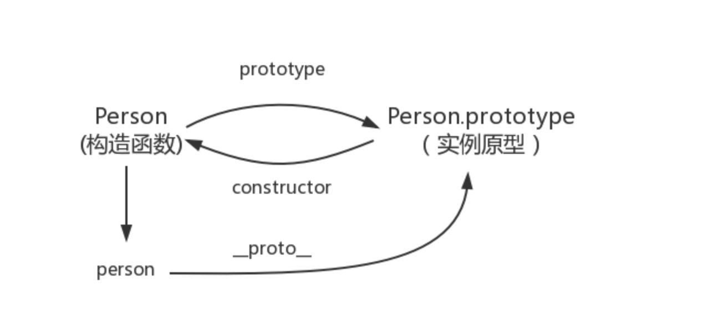
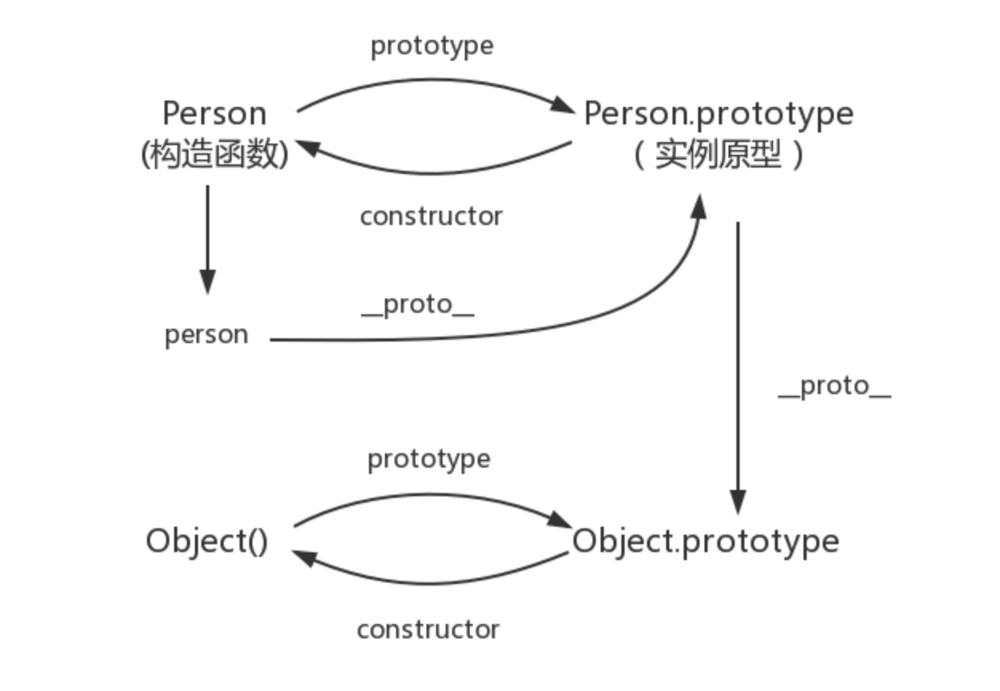
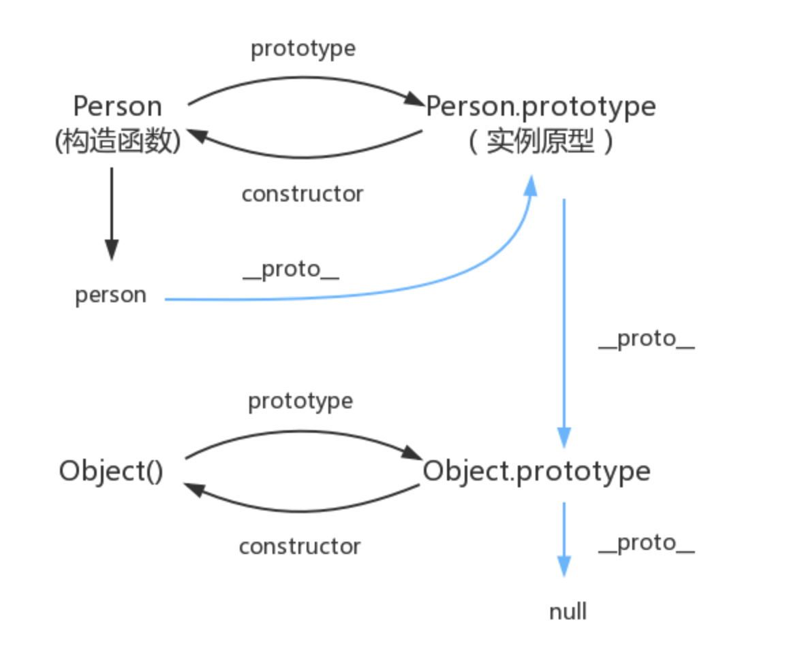

# javaScript 深入之从原型到原型链

## 构造函数创建对象

我们先使用构造函数创建一个对象：

```js
function Person() {

}
var person = new Person()
person.name = 'Jack'
console.log(person.name)
```

在这个例子中， Person就是一个构造函数，我们使用new创建了一个实例对象person。
接下来进入主题：

## prototype

每个函数都有prototype属性，比如

```js
function Person() {

}
// prototype是函数才会有的属性
Person.prototype.name = 'kevin';
let person1 = new Person()
let person2 = new Person()
console.log(person1.name) // kevin
console.log(person2.name) // kevin

```

那这个函数的prototype属性到底指向的是什么呢？是这个函数的原型吗？

其实，函数的prototype属性指向了一个对象，这个对象正是调用该构造函数而创建的实例的原型，也就是这个例子中person1和person2的原型

那么什么是原型呢？

定义： 每一个JavaScript对象(null除外)在创建的时候就会与之关联一个对象，这个对象就是我们所说的原型，每一个对象都会从原型“继承”属性。

让我们用一张图表示构造函数和实例原型之间的关系：


这张图中我们用Object.prototype表示原型实例。

那么我们该怎么表示实例与原型实例，也就是person和Person.prototype之间的关系呢，这时候我们就要讲到第二个属性：

## __ proto __

这是每一个JavaScript对象(除了null)都具有的一个属性，叫__ proto __， 这个属性会指向该对象的原型

```js

function Person() {}
let person = new Person()
console.log(person.__proto__ === Person.prototype); // true

```

于是我们更新下关系图


既然实例对象和构造函数都可以指向原型，那么原型是否有属性指向构造函数或者实例呢？

## constructor

指向实例倒是没有，因为一个构造函数可以生成多个实例，但是原型指向构造函数倒是有的，这就要讲到第三个属性：constructor，每个原型都有一个constructor属性指向关联的构造函数。

```js

function Person() {}
console.log(Person === Person.prototype.constructor); // true

```

所以再更新下关系图：


综上我们已经得出：

```js

function Person() {};

let person = new Person();
console.log(person.__proto__ == Person.prototype) // true
console.log(Person.prototype.constructor == Person) // true
// 顺便学习一个ES5的方法，可以获得对象
console.log(Object.getPrototypeOf(person) === Person.prototype) // true

```

了解了构造函数、实例原型、和实例之间的关系，接下来我们讲讲实例和原型之间的关系：

## 实例与原型

当读取实例的属性是，如果找不到，就会查找与对象关联的原型中的属性，如果还查不到，就去找原型的原型，一直找到最顶层为止

```js

function Person() {}

Person.prototype.name = 'kevin';
let person = new Person();
person.name = 'Daisy';
console.log(person.name) // Daisy
delete person.name;
console.log(person.name) // Kevin

```

在这个例子汇总，我们给实例对象person添加了name属性，当我们打印person.name的时候，结果自然为Daisy。

但是当我们删除了person.name 属性时，读取person.name，从person对象中找不到name属性，就会从person的原型也就是person.__ proto __, 也就是Person.prototype中查找，那么万一没有找到呢？所以，原型的原型是什么？

## 原型的原型

在前面，我们已经讲了原型也是一个对象，既然是对象，那么我们就可以用最原始的方式创建它，也就是：

```js

let obj = new Object();
obj.name = 'kevin';
console.log(obj.name) // kevin
```

其实原型对象就是通过 **Object** 构造函数生成的，结合之前所讲， 实例的 __ proto __ 指向构造函数的prototype，所以我们再更新下关系图：


## 原型链

那 Object.prototype的原型呢？
null， 我们可以打印：

```js

console.log(Object.prototype.__proto__ === null) // true

```

然后null究竟是什么呢？
引用阮一峰老师的《undefined与null的区别》就是：
> null 表示“没有对象”，即该处不应该有值

所以Object.prototype.__ proto __ 的值为null跟Object.prototype 没有原型，其实表达了同一个意思，所以查找属性的时候查到Object.prototype 就停止查找

最后一张关系图也可以更新为：



## 补充
最后，补充三点：

### constructor

首先是constructor属性

```js
function Person() {}
let person = new Person();
console.log(person.constructor === Person) // true

```

当获取person.constructor时，其实person中并没有constructor属性，当不能读取到constructor属性时会从person的原型，也就是Person.constructor中读取，正好该原型只能够有该属性，所以：

```js
person.constructor == Person.prototype.constructor
```

## __ proto__

其次是__ proto __ , 绝大部分浏览器都支持这个非标准的方法访问原型，然而它并不存在于Person.prototype中，实际上，它来自于Object.prototype ，与其说是一个方法，不如说是一个getter/setter，当使用obj.__ proto__ 时，可以理成返回了Object.getPrototypeOf(obj)

## 真的是继承吗

最后是关于继承，前面我们讲到“每一个对象都会从原型‘继承’属性”，实际上，继承是一个十分具有迷惑性的说法，引用《你不知道的JavaScript》中的话，就是：
> 继承意味着复制操作，然而JavaScript默认并不会复制对象的属性，相反，JavaScript只是两个对象之间创建了一个关联，这样，一个对象就可以通过委托访问另一个对象的属性和函数，所以，与其叫继承，委托的说法反而更准确一些


